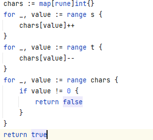
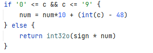

# 反转字符串

编写一个函数，其作用是将输入的字符串反转过来。输入字符串以字符数组 s 的形式给出。

不要给另外的数组分配额外的空间，你必须原地修改输入数组、使用 O(1) 的额外空间解决这一问题。

#### 示例：

输入：s = ["h","e","l","l","o"]
输出：["o","l","l","e","h"]

#### 思路：

 

# 整数反转

给你一个 32 位的有符号整数 x ，返回将 x 中的数字部分反转后的结果。

如果反转后整数超过 32 位的有符号整数的范围 [−231,  231 − 1] ，就返回 0。
假设环境不允许存储 64 位整数（有符号或无符号）

#### 示例：

输入：x = 123     输出：321

输入：x = -123	输出：-321

输入：x = 120	输出：21

#### 思路：

设置一个变量tmp:=0,for循环x!=0，然后执行tmp=tmp*10+x%10,x/=10,最后判断是否有效

# 字符串中的第一个唯一字符

给定一个字符串 s ，找到 它的第一个不重复的字符，并返回它的索引 。如果不存在，则返回 -1 。

#### 示例 ：

输入: s = "leetcode" 输出: 0

输入: s = "loveleetcode" 输出: 2

输入: s = "aabb" 输出: -1

#### 思路：

定义一个make([]int,26),循环字符串-->result[s[i]-'a']++，最后再循环一边-->值为1，返回i

# 有效的字母异位词

给定两个字符串 s 和 t ，编写一个函数来判断 t 是否是 s 的字母异位词。

注意：若 s 和 t 中每个字符出现的次数都相同，则称 s 和 t 互为字母异位词。

#### 示例 :

输入: s = "anagram", t = "nagaram"	输出: true

输入: s = "rat", t = "car"	输出: false

#### 思路：

 

# 验证回文串

如果在将所有大写字符转换为小写字符、并移除所有非字母数字字符之后，短语正着读和反着读都一样。则可以认为该短语是一个 回文串 。字母和数字都属于字母数字字符。给你一个字符串 s，如果它是 回文串 ，返回 true ；否则，返回 false 。

#### 示例：

输入: s = "A man, a plan, a canal: Panama"
输出：true
解释："amanaplanacanalpanama" 是回文串。

#### 思路：

通过strings.ToLower(s)将字符串变为小写，定义 i,j:=0,len(s)-1 ，for i < j 然后判断s[i]或者s[j]是否为字母数字字符，若不是啧i++或j++，判断s[i] != s[j]返回false，最后返回true

# 字符串转换整数 

请你来实现一个 myAtoi(string s) 函数，使其能将字符串转换成一个 32 位有符号整数（类似 C/C++ 中的 atoi 函数）。

函数 myAtoi(string s) 的算法如下：

    读入字符串并丢弃无用的前导空格
    检查下一个字符（假设还未到字符末尾）为正还是负号，读取该字符（如果有）。 确定最终结果是负数还是正数。 如果两者都不存在，则假定结果为正。
    读入下一个字符，直到到达下一个非数字字符或到达输入的结尾。字符串的其余部分将被忽略。
    将前面步骤读入的这些数字转换为整数（即，"123" -> 123， "0032" -> 32）。如果没有读入数字，则整数为 0 。必要时更改符号（从步骤 2 开始）。
    如果整数数超过 32 位有符号整数范围 [−231,  231 − 1] ，需要截断这个整数，使其保持在这个范围内。具体来说，小于 −231 的整数应该被固定为 −231 ，大于 231 − 1 的整数应该被固定为 231 − 1 。
    返回整数作为最终结果。

注意：

    本题中的空白字符只包括空格字符 ' ' 。
    除前导空格或数字后的其余字符串外，请勿忽略 任何其他字符。

#### 示例 ：

输入：s = "42"	输出：42

输入：s = "   -42"	输出：-42

输入：s = "4193 with words"	输出：4193

#### 思路：

 

# 实现 strStr()

给你两个字符串 haystack 和 needle ，请你在 haystack 字符串中找出 needle 字符串的第一个匹配项的下标（下标从 0 开始）。如果 needle 不是 haystack 的一部分，则返回  -1 。

#### 示例 ：

输入：haystack = "sadbutsad", needle = "sad"
输出：0
解释："sad" 在下标 0 和 6 处匹配。
第一个匹配项的下标是 0 ，所以返回 0 。

#### 思路：

双层循环，逐一比较，当j == len(needle) --> return i

# 外观数列

# 最长公共前缀

编写一个函数来查找字符串数组中的最长公共前缀。如果不存在公共前缀，返回空字符串 ""。

#### 示例 ：

输入：strs = ["flower","flow","flight"]	输出："fl"

#### 思路：

