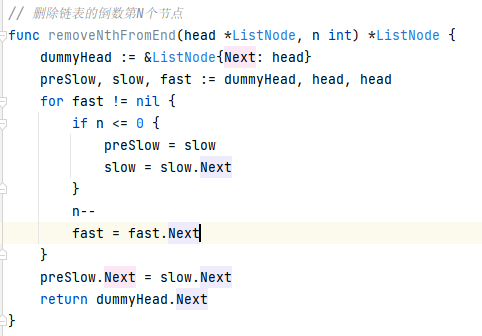
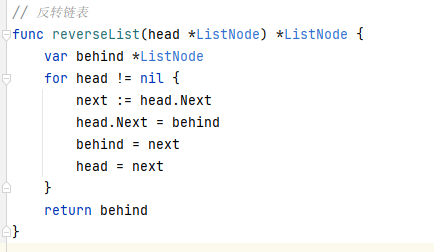

# 删除链表中的节点

有一个单链表的 head，我们想删除它其中的一个节点 node。

给你一个需要删除的节点 node 。你将无法访问 第一个节点  head。

链表的所有值都是唯一的，并且保证给定的节点 node 不是链表中的最后一个节点。

### 示例 ：

输入：head = [4,5,1,9], node = 5
输出：[4,1,9]
解释：指定链表中值为 5 的第二个节点，那么在调用了你的函数之后，该链表应变为 4 -> 1 -> 9

### 思路：

```go
func deleteNode(node *ListNode) {
   node.Val = node.Next.Val
   node.Next = node.Next.Next
}
```

# 删除链表的倒数第N个节点

给你一个链表，删除链表的倒数第 `n` 个结点，并且返回链表的头结点。

### **示例 ：**

```
输入：head = [1,2,3,4,5], n = 2
输出：[1,2,3,5]
```

### 思路：

这道题有一种特别简单的解法。设置 2 个指针，一个指针距离前一个指针 n 个距离。同时移动 2 个指针，2 个指针都移动相同的距离。当一个指针移动到了终点，那么前一个指针就是倒数第 n 个节点了。

 

# 反转链表

给你单链表的头节点 `head` ，请你反转链表，并返回反转后的链表。

###  示例：

```
输入：head = [1,2,3,4,5]
输出：[5,4,3,2,1]
```

### 思路：

 

# 合并两个有序链表

将两个升序链表合并为一个新的 **升序** 链表并返回。新链表是通过拼接给定的两个链表的所有节点组成的。 

### 示例：

```
输入：l1 = [1,2,4], l2 = [1,3,4]
输出：[1,1,2,3,4,4]
```

### 思路：

```go
func mergeTwoLists(l1 *ListNode, l2 *ListNode) *ListNode {
	if l1 == nil {
		return l2
	}
	if l2 == nil {
		return l1
	}
	if l1.Val < l2.Val {
		l1.Next = mergeTwoLists(l1.Next, l2)
		return l1
	}
	l2.Next = mergeTwoLists(l1, l2.Next)
	return l2
}
```

# 回文链表

给你一个单链表的头节点 `head` ，请你判断该链表是否为回文链表。如果是，返回 `true` ；否则，返回 `false` 。

### 示例：

```
输入：head = [1,2,2,1]
输出：true
```

### 思路：

循环链表逐一添加到slice中，循环i, j := 0, len(slice)-1; i < j;

```
if slice[i] != slice[j] {
   return false
}
i++
j--
```

# 环形链表

给你一个链表的头节点 head ，判断链表中是否有环。

如果链表中有某个节点，可以通过连续跟踪 next 指针再次到达，则链表中存在环。 为了表示给定链表中的环，评测系统内部使用整数 pos 来表示链表尾连接到链表中的位置（索引从 0 开始）。注意：pos 不作为参数进行传递 。仅仅是为了标识链表的实际情况。

### 思路：

给 2 个指针，一个指针是另外一个指针的下一个指针。快指针一次走 2 格，慢指针一次走 1 格。如果存在环，那么前一个指针一定会经过若干圈之后追上慢的指针。